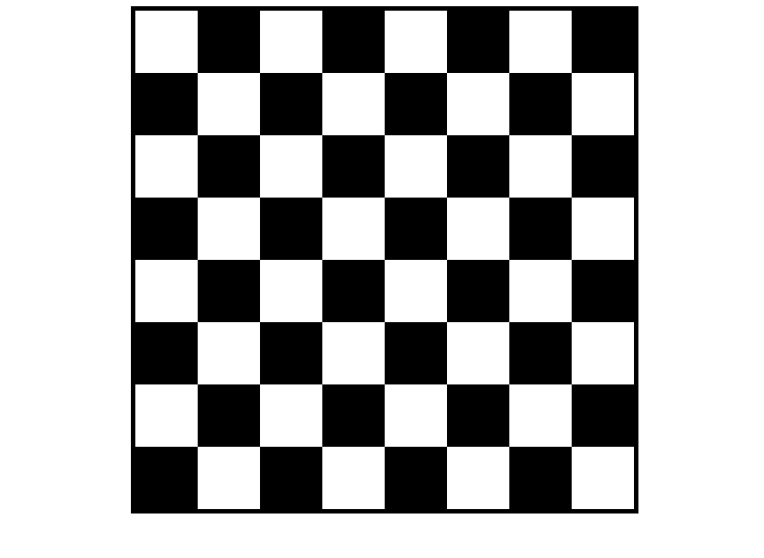

# Chessboard using HTML & CSS

This is a simple chessboard created using **HTML** and **CSS Grid**.

## 🎯 What it includes
- 8 x 8 chessboard layout
- Each square is 100px x 100px
- Uses basic HTML and CSS only

## ▶️ How to run
Just open the `index.html` file in any browser — chessboard will display.

## ✨ Colors
- White squares: `white`
- Black squares: `black`

## 📷 Preview

  

Made as a beginner HTML/CSS project ♟️
